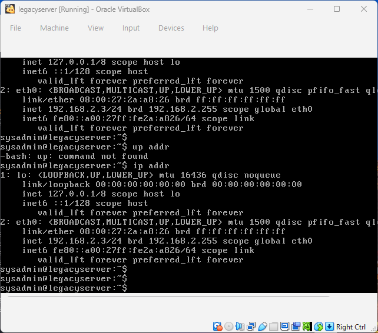
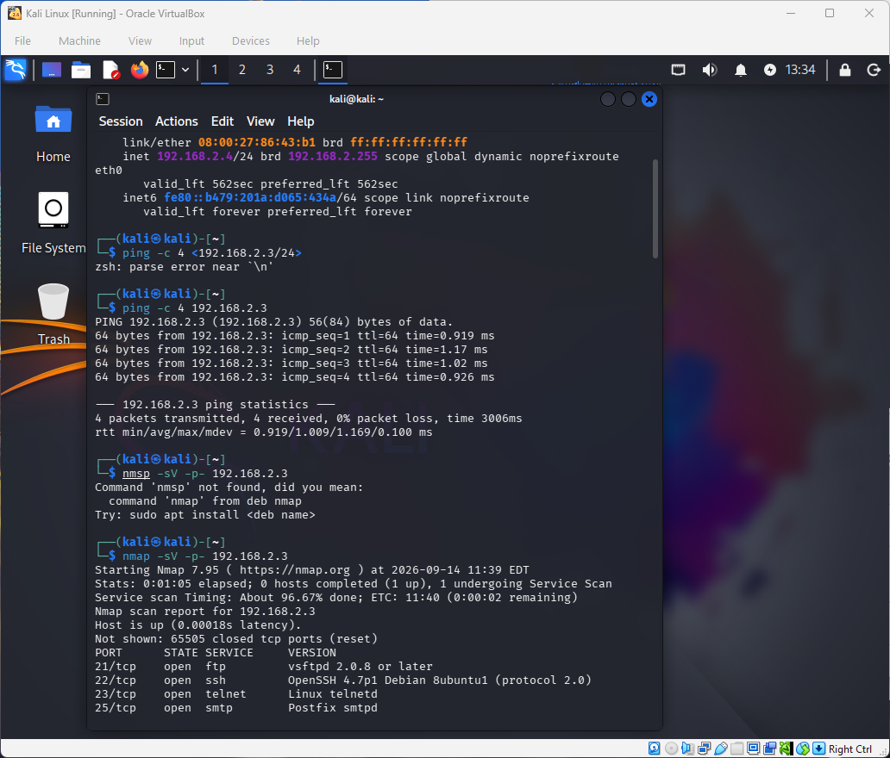
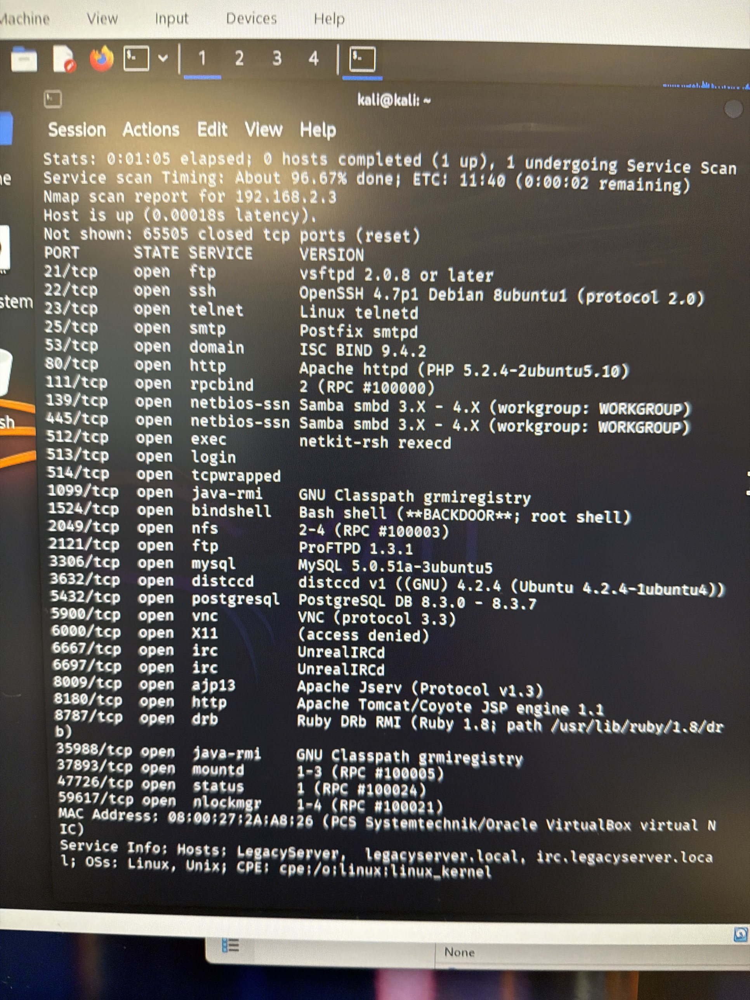

# Phase 1 — Prepare

**Objective:** stand up an isolated lab environment, confirm connectivity between
the analyst host and the target, and run an initial reconnaissance sweep to
establish a baseline of what the target exposes.

## Environment

- Isolated VirtualBox NAT Network (`192.168.2.0/24`), with no route to the host's
  production network.
- **Analyst VM:** Kali Linux — `192.168.2.4`
- **Target VM:** legacy Ubuntu server — `192.168.2.3`

## Steps

1. Built the NAT network and attached both VMs to it.
2. Confirmed IP addressing on both hosts.
3. Verified clean connectivity with `ping`.
4. Ran a full TCP port and service/version sweep from the analyst host:

   ```
   nmap -sV -p- 192.168.2.3
   ```

## Result

**30 open ports** on the target — a wide, unpatched attack surface, including one
port nmap itself flagged outright as an active unauthenticated root backdoor
(`bindshell` on port 1524). This baseline drove every subsequent phase.

## Evidence

| | |
|---|---|
| Network setup |  |
| IP confirmation |  |
| Connectivity check |  |
| Full port/service sweep |  |
