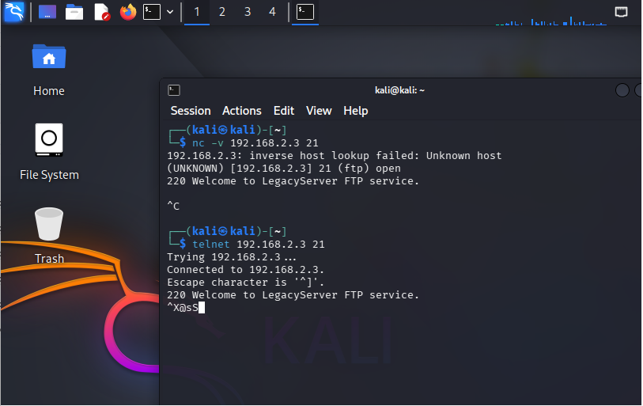
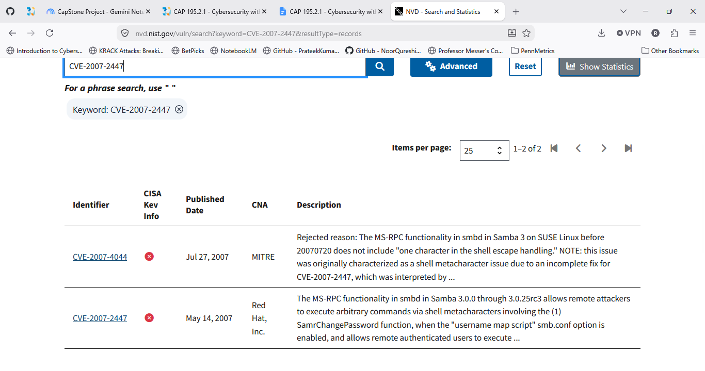
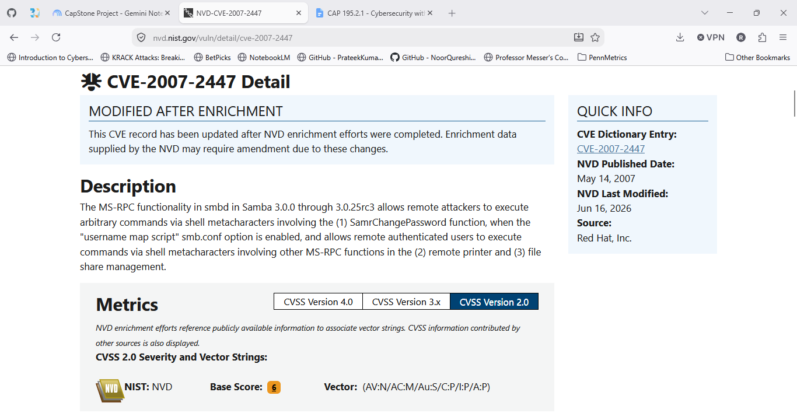
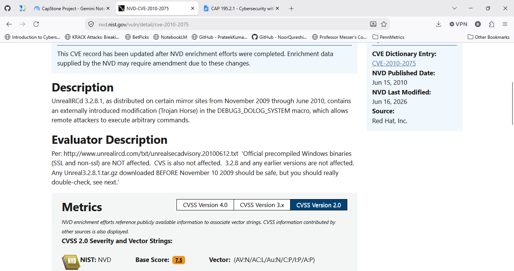

# Phase 2 — Detect & Analyze

**Objective:** turn the Phase 1 port sweep into confirmed vulnerabilities —
every AI-suggested CVE candidate manually verified against its actual NVD
detail page before being trusted.

## Method

1. Ran a deep vulnerability sweep (`nmap --script vuln`) against the target.
2. Used Claude to propose CVE candidates matching the observed service versions
   and script output.
3. Manually opened and read the actual NVD/MITRE detail page for every
   candidate — not the search-results list — to confirm the description
   matched and to record the real CVSS score.
4. Built an attack path hypothesis from the confirmed findings.

## A key lesson: a quiet banner is not proof of safety

The vsftpd finding is the clearest example of why "trust but verify" mattered
in practice. A passive banner grab (`nc`/`telnet`) returned no version string,
which initially looked like an inconclusive, low-priority result. But a banner
can be customized without patching the underlying flaw — it's evidence of
*nothing* either way. Running the full NSE vulnerability sweep actually
triggered the backdoor and returned a live root shell (`uid=0`) — direct,
behavioral proof the flaw was present and exploitable. That reversed the
finding from "disregard" to **Confirmed, Critical**, and is the reason every
finding below is behavior-verified, not just banner-inferred.

## Confirmed vulnerability matrix

| Service | Port | CVE | CVSS | Status | Remediation |
|---|---|---|---|---|---|
| vsftpd | 21 | CVE-2011-2523 | 9.8 | **Confirmed — exploit-verified** | Reinstall from an official, non-backdoored source |
| distccd | 3632 | CVE-2004-2687 | 9.3 | **Confirmed — exploit-verified** | Disable, or restrict to localhost; upgrade past 3.1 |
| UnrealIRCd | 6667, 6697 | CVE-2010-2075 | 7.5 | Confirmed | Reinstall from official checksum-verified source |
| Samba smbd | 139, 445 | CVE-2007-2447 | 6.0 | Confirmed | Disable `username map script`; upgrade past 3.0.25rc3 |
| Ingreslock bindshell | 1524 | N/A (backdoor) | 10.0 (informal) | Confirmed | Kill process; block port; remove startup entry |
| Java RMI | 1099, 35988 | CVE-2011-3556 (likely) | — | Confirmed by NSE script | Disable remote class loading, or restrict to localhost |
| Apache httpd | 80, 8180 | CVE-2007-6750 (Slowloris) | — | Confirmed | Request-timeout/connection-limit mitigations, or upgrade |

Additional findings from the full sweep (documented, lower priority): POODLE
(CVE-2014-3566), Logjam (CVE-2015-4000), CCS Injection (CVE-2014-0224),
anonymous DH MITM exposure, and SQLi/CSRF exposure in bundled demo web apps.

## Attack path hypothesis

30 exposed services with no evidence of patching. Two independent,
unauthenticated root-level backdoors were confirmed — either alone explains
the original NOC detection. A third confirmed vector (distccd) independently
grants remote command execution. Samba's command-injection flaw, the
trojaned UnrealIRCd binary, and an insecure Java RMI registry further widen
the attack surface. The presence of *multiple, unrelated* backdoor/RCE
vectors on one host — not any single flaw — is the real story: this server's
age and total lack of hardening is the core exposure.

## Evidence

| | |
|---|---|
| vsftpd banner grab (inconclusive on its own) |  |
| Samba CVE — NVD search |  |
| Samba CVE — NVD detail (verified) |  |
| UnrealIRCd CVE — NVD detail (verified) |  |
