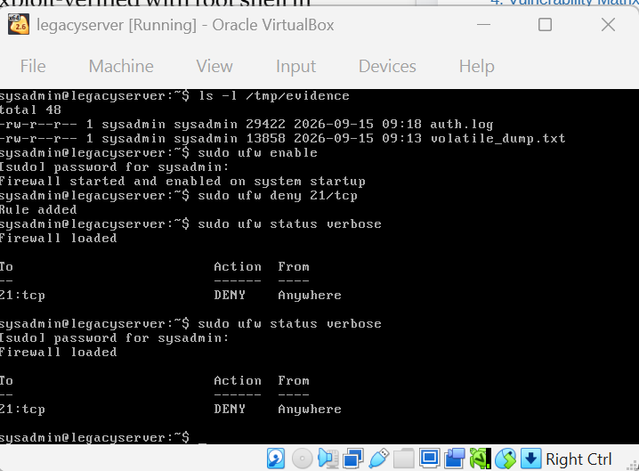
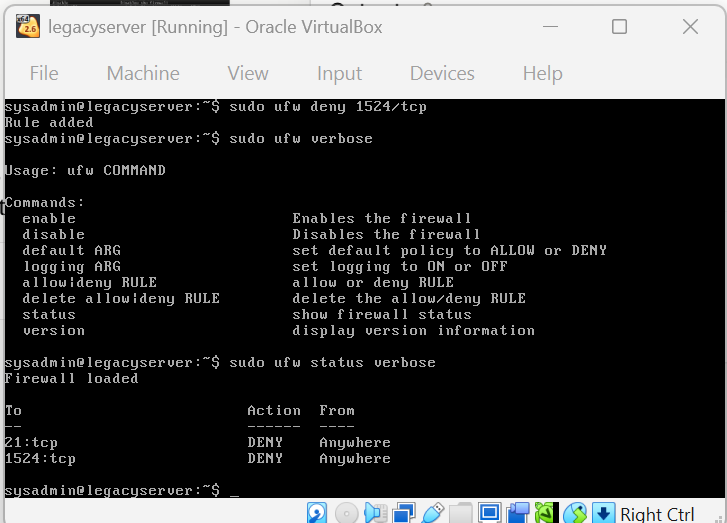
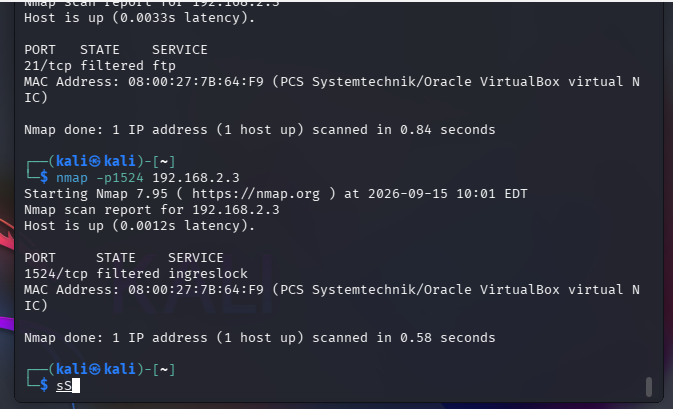

# Phase 3 — Contain

**Objective:** preserve volatile forensic evidence before touching anything,
then stop the two confirmed root backdoors without taking the server offline.

## 1. Volatile data capture (before any change to the system)

Run on the target, before any containment action, so live process/connection
state wasn't lost to a later restart:

```bash
mkdir -p /tmp/evidence
{ ss -tulpn; ps aux; w; } > /tmp/evidence/volatile_dump.txt
cp /var/log/auth.log /tmp/evidence/
```

## 2. Surgical containment

A full shutdown would have taken down the legacy business application the
server hosts, so containment used the host firewall to block only the two
confirmed exploited ports, rather than disrupting the whole system:

```bash
sudo ufw enable
sudo ufw deny 21/tcp      # vsftpd backdoor
sudo ufw deny 1524/tcp    # Ingreslock bindshell
```

## 3. Mitigation verification

From the analyst host, each blocked port was re-scanned to confirm the block
was *actually working*, not just configured:

```bash
nmap -p21 192.168.2.3     # before: open  → after: filtered
nmap -p1524 192.168.2.3   # before: open  → after: filtered ingreslock
```

The server stayed online throughout — no full shutdown, satisfying the
surgical/non-disruptive containment goal.

## A verification mistake worth flagging

My first attempt at proving a port was blocked wasn't rigorous enough, and
it's a more useful lesson documented honestly than smoothed over. `ufw` has
a **default policy of DROP on all inbound traffic**, independent of any one
specific `deny` rule — visible directly in the underlying table:

```bash
sudo iptables -L INPUT -n --line-numbers
# Chain INPUT (policy DROP)
```

That means deleting a single `ufw deny` rule to test whether a port is
genuinely *closed* (service gone) versus merely *filtered* (blocked by the
firewall) doesn't actually prove anything — the default DROP policy keeps
blocking everything regardless of that one rule. An early "closed" reading
for port 21 was only valid by coincidence, because `ufw` happened to be
fully unloaded at that exact moment. It was not a repeatable test.

**Fix:** fully disable `ufw` (`sudo ufw disable`) for every verification
scan going forward, then re-enable it and restore the deny rules immediately
after. This distinction — and the discipline to test for it every time —
carried directly into Phase 4's permanent-fix verification.

## Evidence

| | |
|---|---|
| Volatile evidence capture confirmed on disk |  |
| Both containment rules active |  |
| Both ports verified filtered from the analyst host |  |
