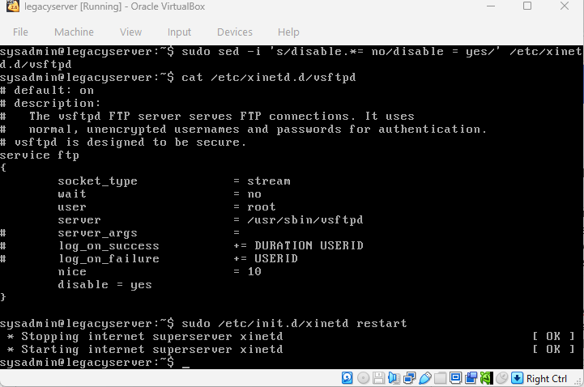
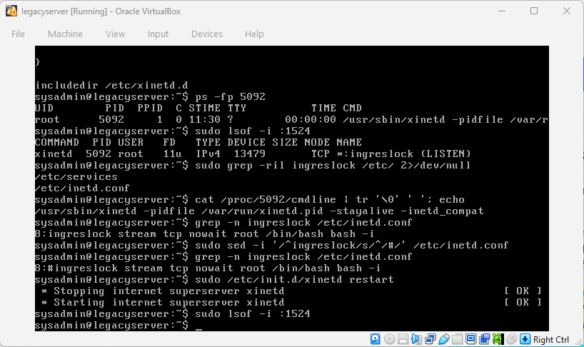
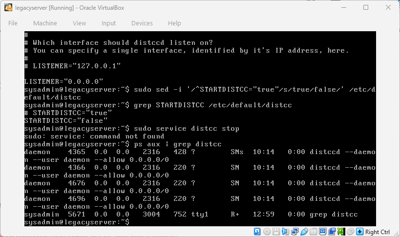
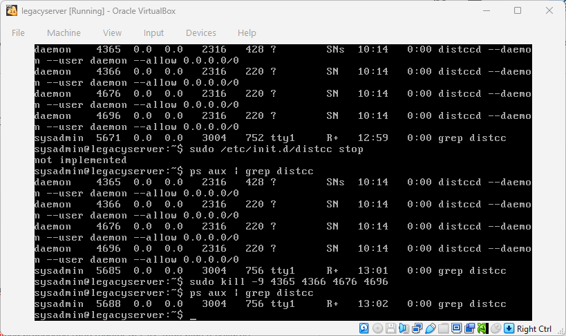
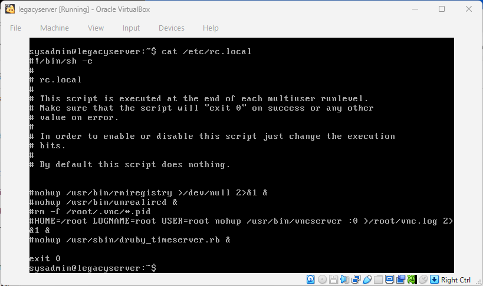
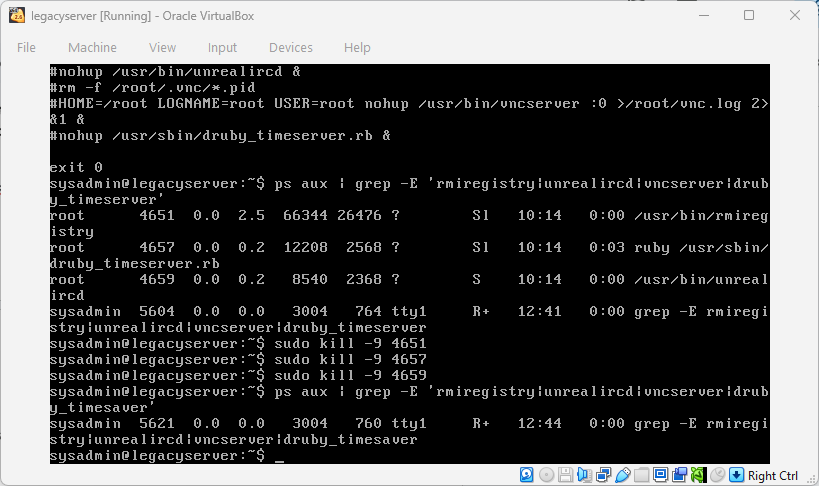
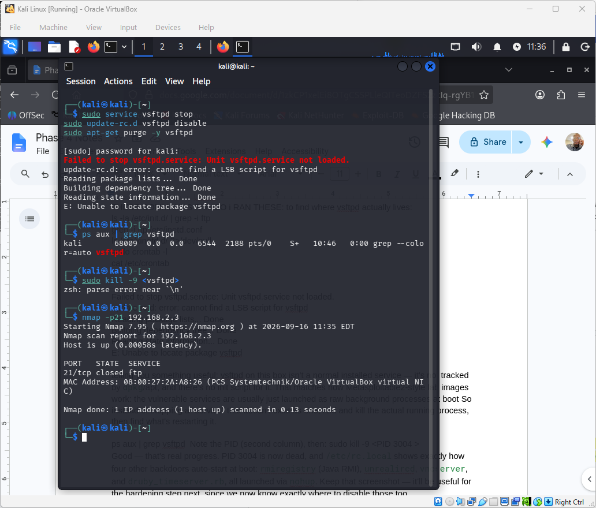
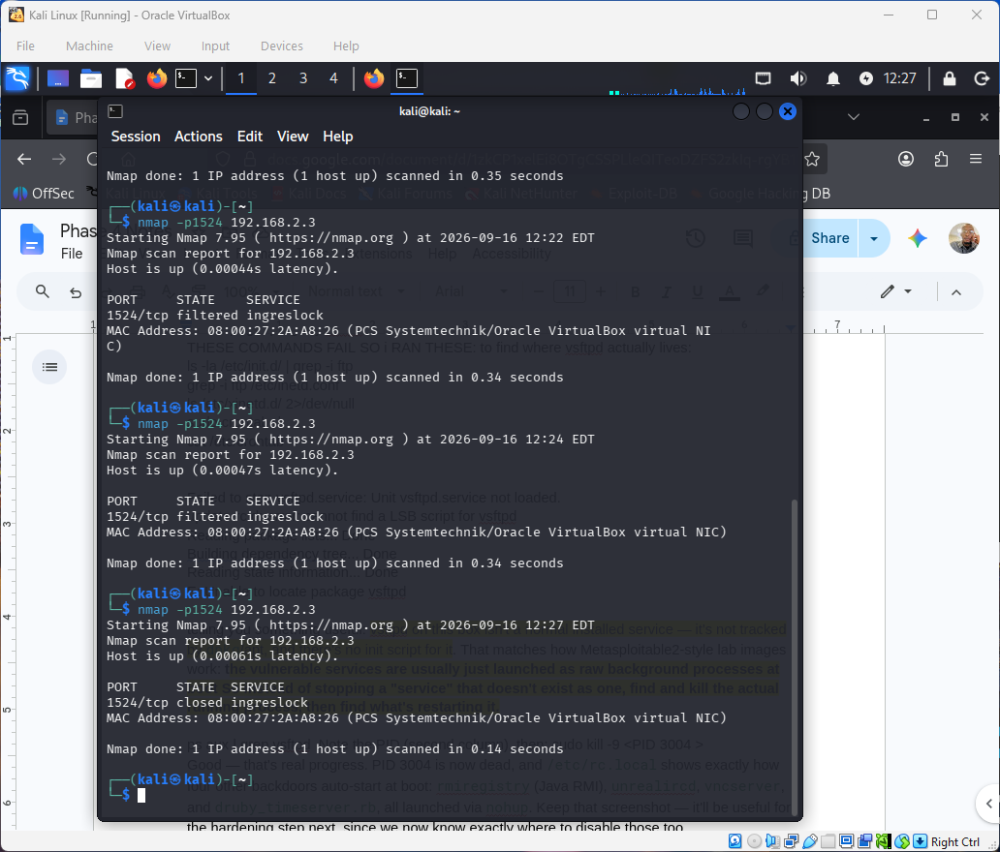
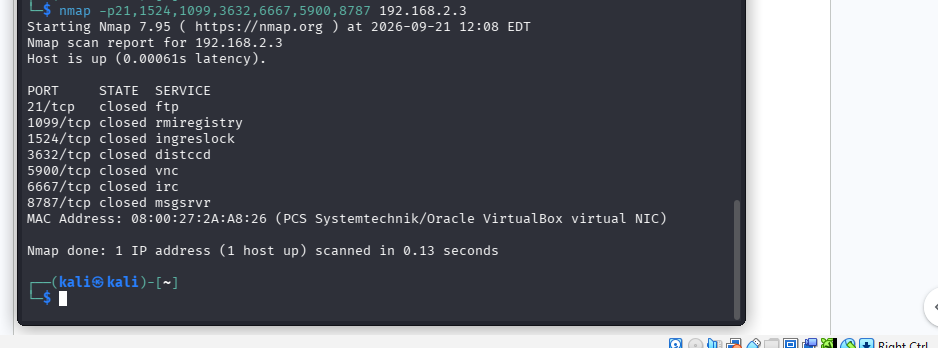
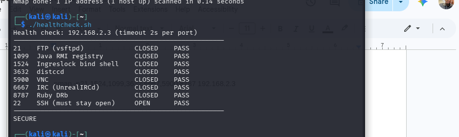

# Phase 4 — Eradicate & Recover

**Objective:** replace Phase 3's firewall block with a real, permanent fix at
each vulnerability's actual source, harden the box by removing unrelated
non-essential services, and stand up an automated way to catch a regression.

## Permanent remediation

Standard commands (`service stop`, `apt-get purge`) failed outright for two
of the three backdoors, because neither was managed the way a textbook
Ubuntu service is. Both had to be traced to their real startup mechanism
before they could be genuinely disabled.

| Vector | Root cause found | Permanent fix | Reboot-safe? |
|---|---|---|---|
| vsftpd (21) — CVE-2011-2523 | Managed by `xinetd` via `/etc/xinetd.d/vsftpd`, not a normal service/package | `disable = yes` set in the xinetd config; live process killed; xinetd restarted | Yes |
| Ingreslock (1524) | Legacy `/etc/inetd.conf` entry, honored only because xinetd was run with `-inetd_compat`; spawned a root `/bin/bash` on connect | Line commented out in `inetd.conf`; live process killed; xinetd restarted | Yes |
| distccd (3632) — CVE-2004-2687 | Properly installed service; `STARTDISTCC="true"` in `/etc/default/distcc` | Set to `"false"`; all 4 live processes killed | Yes |

### Finding the invisible backdoor — the actual trace

The Ingreslock backdoor is the most instructive part of this phase. It had
**no entry anywhere in `/etc/xinetd.d/`** — the config directory every guide
tells you to check. Finding it took working backward from the live network
state instead of guessing at more config locations:

1. `netstat`/`lsof` on the open port → identified the PID holding it open.
   It belonged to `xinetd`, which normally *shouldn't* be listening there
   directly.
2. `ps -fp <pid>` / `cat /proc/<pid>/cmdline` → revealed xinetd had been
   launched with an undocumented `-inetd_compat` flag.
3. That flag means xinetd *also* honors the legacy `/etc/inetd.conf` format
   alongside its normal directory — a config location with zero trace in
   the modern xinetd tooling.
4. `grep -n ingreslock /etc/inetd.conf` → found the actual line:
   `ingreslock stream tcp nowait root /bin/bash bash -i` — an unauthenticated
   root shell for anyone who connects to port 1524.

This is the kind of finding a checklist scan misses entirely; it only turns
up by reasoning backward from what the system is actually doing.

## Hardening — attack surface reduction

Four more non-essential services were found auto-starting at boot via bare
`nohup ... &` lines in `/etc/rc.local` — no service, package, or systemd unit
for any of them:

| Vector | Fix |
|---|---|
| Java RMI (1099) | `rmiregistry` line in `rc.local` commented out; live process killed |
| UnrealIRCd (6667/6697) — CVE-2010-2075 | `unrealircd` line commented out; live process killed |
| Ruby DRb (8787) | `druby_timeserver` line commented out; live process killed |
| VNC (5900) | Both VNC lines commented out |

## Independent verification

Because of the firewall lesson learned in Phase 3, `ufw` was fully disabled
for a clean read before every scan, then restored immediately after:

| Port / Service | Before | After |
|---|---|---|
| 21 — vsftpd | open | **closed** |
| 1524 — Ingreslock | open | **closed** |
| 1099 — Java RMI | open | **closed** |
| 3632 — distccd | open | **closed** |
| 6667 — UnrealIRCd | open | **closed** |
| 5900 — VNC | open | **closed** |
| 8787 — Ruby DRb | open | **closed** |

`closed` here means the service is genuinely gone — TCP RST, nothing
listening — not just hidden behind the firewall.

## Automated health check

A pure-Bash script ([`scripts/healthcheck.sh`](../scripts/healthcheck.sh)) —
the team-standard Task 10 check, adapted from a version written by teammate
Parker Collins and independently verified in each member's own lab — sweeps
the 7 remediated ports plus SSH using Bash's `/dev/tcp` pseudo-device. It
reports three states per port (`OPEN` / `CLOSED` / `FILTERED`), not just a
pass/fail, so it can tell a genuinely-removed service apart from one that's
just hidden behind the firewall — the exact distinction the Phase 3
verification mistake was about. The SSH check guards against a false
"SECURE" reading if the host itself is simply down. Result is `SECURE` only
if all 7 remediated ports are non-open **and** SSH responds.

```
$ ./healthcheck.sh
Health check: 192.168.2.3 (timeout 2s per port)
------------------------------------------------------
21    FTP (vsftpd)             CLOSED    PASS
1099  Java RMI registry        CLOSED    PASS
1524  Ingreslock bind shell    CLOSED    PASS
3632  distccd                  CLOSED    PASS
5900  VNC                      CLOSED    PASS
6667  IRC (UnrealIRCd)         CLOSED    PASS
8787  Ruby DRb                 CLOSED    PASS
22    SSH (must stay open)     OPEN      PASS
------------------------------------------------------
SECURE
```

As with the scan table above, run this with `ufw` disabled for a clean read
— otherwise a port that's still there but firewall-blocked will read
`FILTERED` instead of the firewall's true state.

**The script caught a real regression during testing.** A run against the
lab VM turned up port 5900 (VNC) unexpectedly `OPEN`/`FAIL` — a live
`Xtightvnc` process had respawned since the original rc.local fix. `sudo ss
-tulpn` identified the PID, `sudo kill -9` on it plus confirming the
rc.local lines were still commented out resolved it; a clean re-run
confirmed `SECURE`. This is the health check doing exactly its job —
catching drift before it shipped as "verified."

See [`docs/05-lessons-learned.md`](05-lessons-learned.md) for the real
debugging story behind the earlier draft of this script (a genuine
zsh-vs-bash environment mismatch), told as a prompt-engineering lesson
rather than polished away.

## Evidence

| | |
|---|---|
| vsftpd permanent fix |  |
| Ingreslock permanent fix |  |
| distccd config change |  |
| distccd processes killed |  |
| rc.local hardening confirmed |  |
| All live processes killed |  |
| Port 21 verified closed |  |
| Port 1524 verified closed |  |
| Final 7-port scan, all closed |  |
| Health check script, RESULT: SECURE |  |
